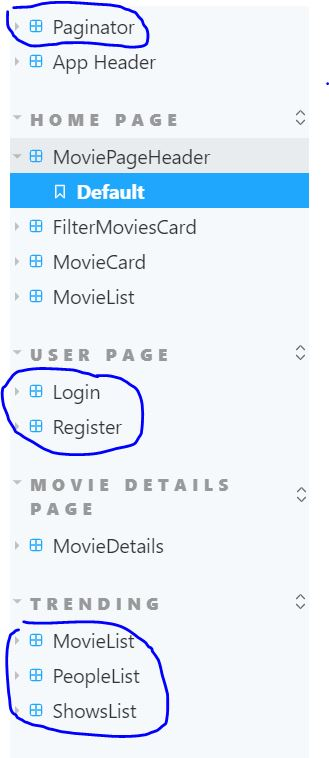

# Movie App Assignment 1

**Denis Moskalenko (20088764) W3 (Games)**

**_List of Added Features_**

# Assignment 1 - ReactJS app.

Name: Denis Moskalenko

## Overview.

Modified Movie Application hosted locally using the tmdb service.

### Features.
[ A bullet-point list of the __new features__ you added to the Movies Fan app (and any modifications to existing features) .]
 
+ Trending Page

+ Login and Register using Firebase and localStorage

+ 3 new endpoints: (Trending Tv Shows) , (Trending People) , (Trending Movies)

+ Pagination using Material UI with caching

+ Responsive UI

+ Extensive Data Hyperlinking

+ StoryBook support

## Setup requirements.

+npm install
+npm install @mui/material 
+npm install -g firebase-tools OR npm install firebase react-router-dom react-firebase-hooks

## API endpoints.

+ Trending Movies / People / TV Shows - /movies/trending
+ WatchList - /movies/watchList
+ Login - /login
+ Register - /register
+ Reviews Form - /reviews/form
+ Upcoming Movies - /movies/upcoming
+ Movie Reviews - /reviews/:id
+ Favourited Movies - /movies/favorites
+ Movie Page - /movies/:id

## App Design.

Added Sticky Paginator to the home page,
Reactive Ui on trending page,
Login Form 
Register Form
Favourite Toggle

### Component catalogue.

Additional storybook implementations.

### UI Design.

Registry Page with Firebase Auth

Login Page with Firebase Auth

Home Page with Pagination and toggle

Trending Page with 3 tmdb endpoints 

>Shows detailed information on a movie. Clicking the 'Reviews' floating action button will display extracts from critic reviews.

### Routing.

+ Login - /login - Authenticated with Firebase
+ Register - /register - Authenticated with Firebase
+ Trending Movies / People / TV Shows - /movies/trending

## Independent learning (If relevant).

[ Itemize the technologies/techniques you researched independently and adopted in your project, i.e. aspects not covered in the lectures/labs. Include the source code filenames that illustrate these (we do not require code excerpts) and provide references to the online resources that helped you (articles/blogs).

#Firebase Auth

https://blog.logrocket.com/user-authentication-firebase-react-apps/

#Pagination

https://mui.com/components/pagination/

